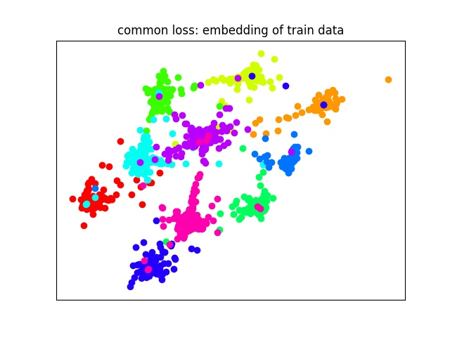
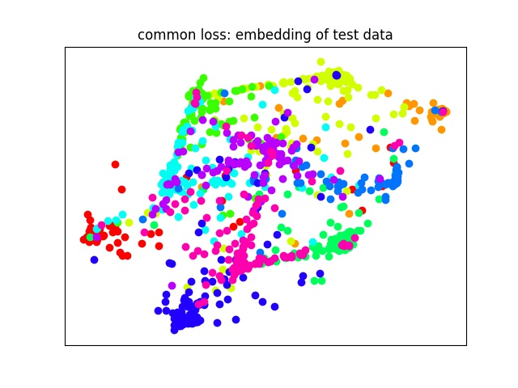
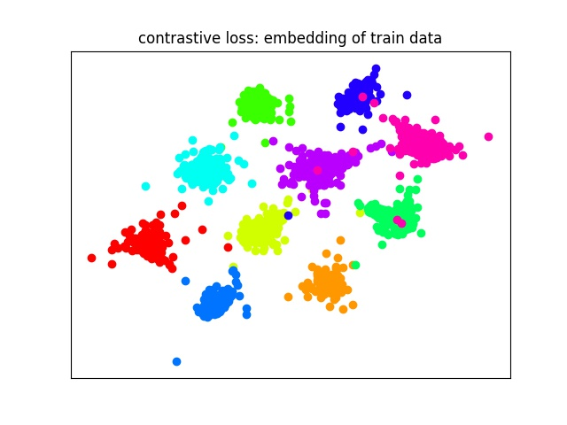
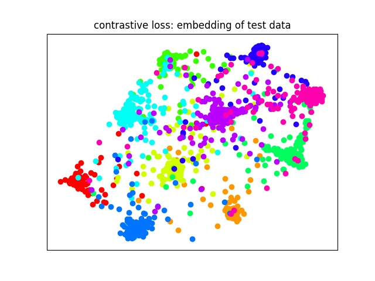

# SiameseNetwork
Siamese Neural Networks

## Discription
- This is a tensorflow implementation for paper [Siamese Neural Networks for One-shot Image Recognition](https://www.cs.cmu.edu/~rsalakhu/papers/oneshot1.pdf). The basic version come from [ywpkwon/siamese_tf_mnist](https://github.com/ywpkwon/siamese_tf_mnist)
- We did two experiments:
	1. L1 distance method
	2. contrastive loss method

## Result
- I used different colors to visualize the embeddings points of train and test data sets in two dimensions.

   

   

- Embedding points and training logs can be find in corresponding directory ([common](./common)/[contrastive](./contrastive)).
